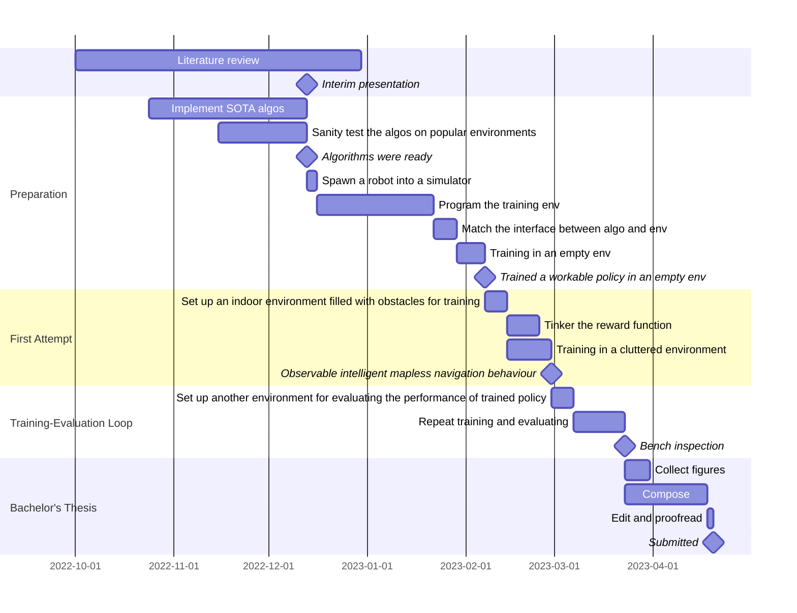

## Demonstrations

https://user-images.githubusercontent.com/86758413/233221789-9ce959f5-4895-4921-9393-2e0eda7233c8.mp4

https://user-images.githubusercontent.com/86758413/233221813-2f6d39f4-ada8-479b-97b9-0966306220dc.mp4

https://user-images.githubusercontent.com/86758413/233753293-8710ea58-4ea1-46d8-b928-f61924262766.mp4

Immediately after the submission of the thesis, someone released [a same project](https://github.com/tomasvr/turtlebot3_drlnav) and the performance is far better than mine.

## Assessment Results

| | Supervisor | Assessor | Mark |
| :- | :-: | :-: | :-: |
| [Specification](feedback/specification-annotated.pdf) | [N/A](feedback/specification-supervisor.pdf) | [60](feedback/specification-assessor.pdf) | 60 (15%) |
| [Interim Presentation](slides/main.pdf) | [71](feedback/interim-presentation-supervisor.pdf) | [66](feedback/interim-presentation-assessor.pdf) (Dr Alex Phillips stood in for Prof Jason Ralph) | 69 (15%) |
| [Bench Inspection](poster/main.pdf) | [79](feedback/bench-inspection-supervisor.pdf) | [73](feedback/bench-inspection-assessor.pdf) | 76 (15%) |
| [Thesis](thesis/thesis.pdf) (with one day late penalty) | [85 - 5](feedback/thesis-supervisor.pdf) | [81 - 5](feedback/thesis-assessor.pdf) | 78 (55%) |
| **Overall** | N/A | N/A | **74** |

## Activity Diary

